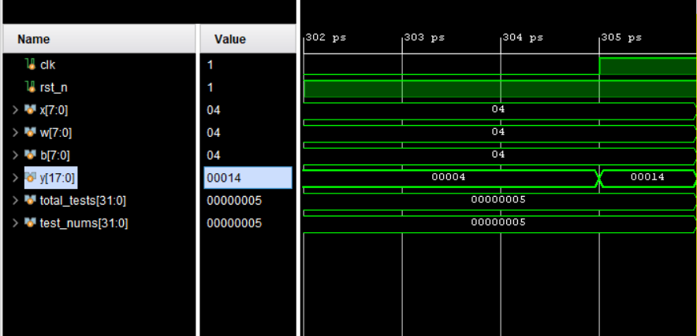
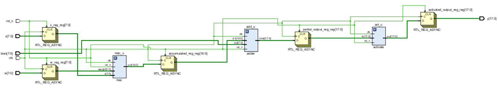
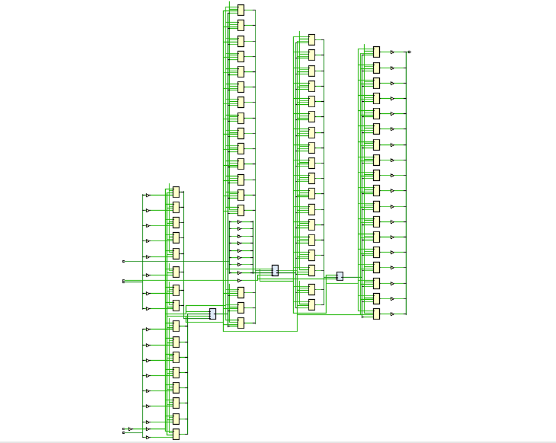
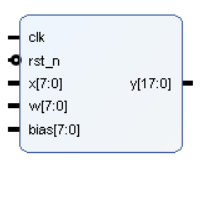

# Neuron Hardware Module

This project implements a hardware model of a **neuron** using Verilog. The neuron uses a **Multiply-and-Accumulate (MAC)** logic to compute weighted inputs, adds a bias, and finally multiplies the result with an activation factor to produce the output.

---

## Neuron Logic

A neuron performs the following operations:

y = max[(input x weight +bias),0]

This is logically split into **three main stages**:

1. **Multiply** each input with its corresponding weight.
2. **Accumulate** the products in hardware.
3. **Add** the bias to the final accumulated result.

Finally, the result is passed through an **activation stage**, where it compares the result and zero. 
If the result is 0 or negative the output y is zero. If not the result is assigned to the output.

---

## Hardware Mapping

To implement this behavior in hardware, the design uses **four key modules**:

- `mac`: Multiplies each input with its weight and accumulates the product of inputs and weights over multiple cycles or instances.
- `adder`: Adds the bias to the accumulated result.
- `activate`: Multiplies the final value with an activation factor (scaled activation output).
-`neuron` : 

Each of these modules can be instantiated and pipelined to build more complex multi-neuron or multi-layer networks.

## The code works !!

 
 

## Design Optimization and IP Packaging

### Constraint-Driven Optimization

To ensure realistic power and timing analysis, I wrote and applied an `.xdc` (Xilinx Design Constraints) file that specified:

- **Clock period** (`create_clock`) for timing analysis
- **Input delays** (`set_input_delay`) to model external signal behavior
- **Switching activity** (`set_switching_activity`) on input and internal nets to prevent overestimation
- **Load/driving characteristics** on I/Os

This reduced Vivado’s reliance on default assumptions, allowing for much more **accurate analysis**.

---

### Timing Closure Achieved

After applying the constraints, I performed synthesis and implementation. The results showed:

- **Setup timing met** with Worst Negative Slack (WNS) > 4.9 ns
- **Hold timing met** with Worst Hold Slack (WHS) > 0.14 ns
- **Pulse width timing met** with Worst Pulse Width Slack (WPWS) > 4.6 ns

No timing violations were reported, ensuring a clean and efficient design pipeline.

---

### Power Optimization

Initial power estimate (due to missing constraints):  
**15.2W** — most of it incorrectly attributed to dynamic I/O.

After applying `.xdc` and re-running implementation:  
**0.089W** total on-chip power  
- Only **8 mW** of dynamic power  
- I/O dynamic reduced from **12.8W ➝ 5 mW**  
- Accurate estimation with high confidence level

---

### IP Packaging

After verifying functionality and optimizing timing/power, I used Vivado's **IP Packager** to package the `neuron` module as a reusable IP core.

Steps followed:
1. Verified all RTL modules (`mac`, `adder`, `activate`, `neuron`) as part of design sources.
2. Set `neuron.sv` as the top module with defined clock/reset interfaces.
3. Used **Tools > Create and Package New IP** to generate a reusable IP core.
4. Validated and exported it as a custom IP block for future integration.

This allows the neuron hardware block to be reused in other Vivado designs and extended with AXI or other interfaces if needed.

## My Reflections while doing this project 

### Before Jumping into the code
- Sit and think through the logic, use pen and paper to name all the nets
- Calculate bit widths properly. I spent lot of time trying to fix the bit width after each module 

### When you code
- Use proper naming conventions and aprropriate comments.
- Understand the purpose of each and every line when typing. 
- Have proper justifications for each logic you have written
- write test benches for each module and test it exhaustively

## If this logic is so stright forward, why there are not much ML implementations on ASIC ?

- If you observe closely, this architecture works well on **intergers**

- ML models require Floating point computation (Real + Fractional part)

- A Floating point 32 (FP32) occupies 32 bits in a memory

- It has one sign bit, 8 exponent bits and 23 fractional bits

- So In hardware, you have to compute for the exponent bits and the fractional bits seperately.

- You need separate datapaths for the exponent and mantissa, plus a lot of glue logic to handle denormals, overflows, underflows, and IEEE-754 corner cases.

- It becomes particularly hard on ASIC platforms due to the lack of limited availability of synthesisable open source IP cores for 
ASIC

- Some IP cores are available on FPGA platforms But translating those into TSMC-PDK-compatible, silicon-proven hard macros is a huge qualification project—and most fabs or IP vendors don’t just hand out synthesizable FP libraries for free.
