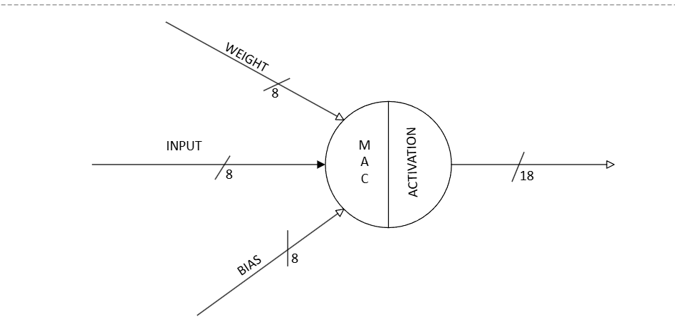
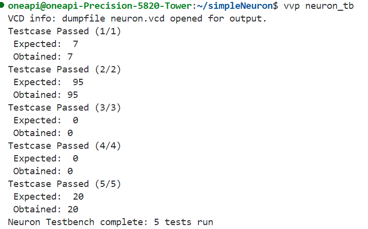

# Neuron Hardware Module

This project implements a hardware model of a **neuron** using Verilog. The neuron uses a **Multiply-and-Accumulate (MAC)** logic to compute weighted inputs, adds a bias, and finally multiplies the result with an activation factor to produce the output.

---

## Neuron Logic

A neuron performs the following operations:

temp = (input0 * weight0 + input1 * weight1 + input2 * weight2) + bias
y = activation_factor * temp

This is logically split into **three main stages**:

1. **Multiply** each input with its corresponding weight.
2. **Accumulate** the products in hardware.
3. **Add** the bias to the final accumulated result.

Finally, the result (`temp`) is passed through an **activation stage**, where it is multiplied by an activation factor to produce the final output `y`.

---

## Hardware Mapping

To implement this behavior in hardware, the design uses **four key modules**:

- `mac`: Multiplies each input with its weight and accumulates the product of inputs and weights over multiple cycles or instances.
- `adder`: Adds the bias to the accumulated result.
- `activate`: Multiplies the final value with an activation factor (scaled activation output).
-`neuron` : 

Each of these modules can be instantiated and pipelined to build more complex multi-neuron or multi-layer networks.

## The code works !!

## My Reflections while doing this project 

### Before Jumping into the code
- Sit and think through the logic, use pen and paper to name all the nets
- Calculate bit widths properly. I spent lot of time trying to fix the bit width after each module 

### When you code
- Use proper naming conventions and aprropriate comments.
- Understand the purpose of each and every line when typing. 
- Have proper justifications for each logic you have written
- write test benches for each module and test it exhaustively

## If this logic is so stright forward, why there are not much ML implementations on ASIC ?

- If you observe closely, this architecture works well on **intergers**

- ML models require Floating point computation (Real + Fractional part)

- A Floating point 32 (FP32) occupies 32 bits in a memory

- It has one sign bit, 8 exponent bits and 23 fractional bits

- So In hardware, you have to compute for the exponent bits and the fractional bits seperately.

- You need separate datapaths for the exponent and mantissa, plus a lot of glue logic to handle denormals, overflows, underflows, and IEEE-754 corner cases.

- It becomes particularly hard on ASIC platforms due to the lack of limited availability of synthesisable open source IP cores for 
ASIC

- Some IP cores are available on FPGA platforms But translating those into TSMC-PDK-compatible, silicon-proven hard macros is a huge qualification project—and most fabs or IP vendors don’t just hand out synthesizable FP libraries for free.